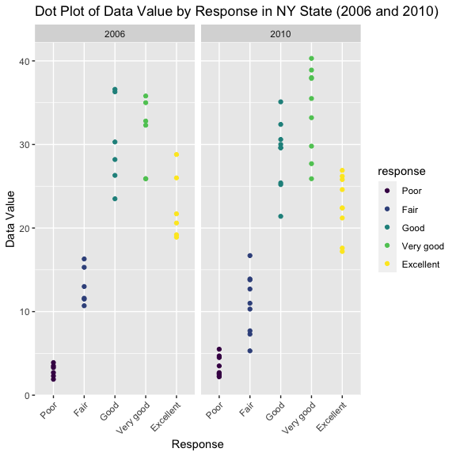
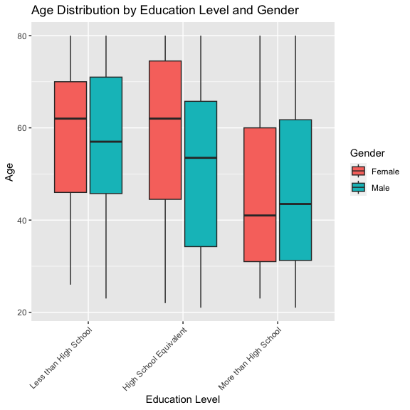
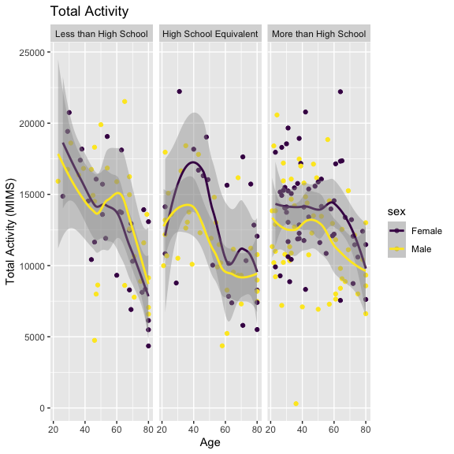
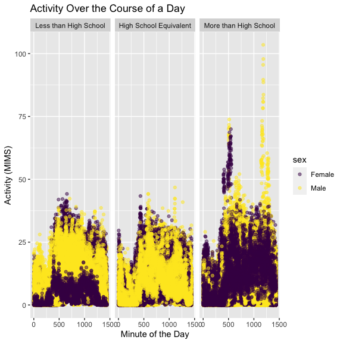

p8105_hw3_co2554
================
Camille Okonkwo
2023-10-14

#### installing the “devtools” package in the console

``` r
devtools::install_github("p8105/p8105.datasets", force = TRUE)
```

### loading up the necessary datasets from the p8105.datasets library, and tidyverse

``` r
library(knitr)
library(tidyverse)
library(p8105.datasets)
library(viridis)
```

### Problem 1: InstaCart

``` r
data("instacart")
```

The Instacart dataset illustrates the online grocery orders of their
application users. The dataset contains 1384617 observations of 131209
unique user ID’s, with each row representing an item from an order.
There is one order per user in this dataset.

There are 15 variables in this dataset, including:

- `order_id`: order identifier

- `product_id`: product identifier

- `add_to_cart_order`: order in which each product was added to cart

- `reordered`: 1 if this prodcut has been ordered by this user in the
  past, 0 otherwise

- `user_id`: customer identifier

- `eval_set`: which evaluation set this order belongs in (Note that the
  data for use in this class is exclusively from the “train” eval_set)

- `order_number`: the order sequence number for this user (1=first,
  n=nth)

- `order_dow`: the day of the week on which the order was placed

- `order_hour_of_day`: the hour of the day on which the order was placed

- `days_since_prior_order`: days since the last order, capped at 30, NA
  if order_number=1

- `product_name`: name of the product

- `aisle_id`: aisle identifier

- `department_id`: department identifier

- `aisle`: the name of the aisle

- `department`: the name of the department

There are 134 aisles in this dataset. The aisles that have the most
ordered items are the fresh vegetables, fresh fruits, packaged
vegetables fruits, yogurt, packaged cheese aisles, respectively.

The following plot will illustrate the number of items ordered in each
aisle:

``` r
ggp_aisle_plot =
  instacart |>
  count(aisle) |>
  arrange(desc(n)) |>
  filter(n > 10000) |>
  arrange(aisle, desc(n)) |>
  mutate(aisle = fct_reorder(aisle, n)) |>
  ggplot(aes(x = aisle, y = n)) +
  geom_point() +
  labs(
    title = "Number of Items Ordered in Each Aisle (Aisles with >10,000 items)",
    x = "Aisle",
    y = "Number of Items Ordered"
  ) +
  theme(axis.text.x = element_text(angle = 60, hjust = 1)) +
  scale_color_viridis_d() 

print(ggp_aisle_plot)
```

<!-- -->

This table includes the three most popular items in each of the aisles
“baking ingredients”, “dog food care, and”packaged vegetable fruits”

``` r
popular_items_table =
instacart |> 
  filter(aisle %in% c("baking ingredients", "dog food care", "packaged vegetables fruits")) |>
  group_by(aisle) |> 
  count(product_name) |> 
  mutate(rank = min_rank(desc(n))) |> 
  filter(rank < 4) |> 
  arrange(desc(n))

kable(popular_items_table,
      col.names = c("Aisle", "Product", "N", "Rank"),
      align = "c")
```

|           Aisle            |                    Product                    |  N   | Rank |
|:--------------------------:|:---------------------------------------------:|:----:|:----:|
| packaged vegetables fruits |             Organic Baby Spinach              | 9784 |  1   |
| packaged vegetables fruits |              Organic Raspberries              | 5546 |  2   |
| packaged vegetables fruits |              Organic Blueberries              | 4966 |  3   |
|     baking ingredients     |               Light Brown Sugar               | 499  |  1   |
|     baking ingredients     |               Pure Baking Soda                | 387  |  2   |
|     baking ingredients     |                  Cane Sugar                   | 336  |  3   |
|       dog food care        | Snack Sticks Chicken & Rice Recipe Dog Treats |  30  |  1   |
|       dog food care        |      Organix Chicken & Brown Rice Recipe      |  28  |  2   |
|       dog food care        |              Small Dog Biscuits               |  26  |  3   |

This next table shows the average hour of the day Pink Lady Apples and
Coffee Ice Cream are ordered.

``` r
apples_coffee_table =
  instacart |>
  filter(product_name %in% c("Pink Lady Apples", "Coffee Ice Cream")) |>
  group_by(product_name, order_dow) |>
  summarize(mean_hour = mean(order_hour_of_day, na.rm = TRUE)) |>
  mutate(
    product_name = factor(product_name, levels = c("Pink Lady Apples", "Coffee Ice Cream")),
    order_dow = factor(order_dow, levels = 0:6, labels = c("Sunday", "Monday", "Tuesday", "Wednesday", "Thursday", "Friday", "Saturday"))
  ) |> 
  pivot_wider(names_from = order_dow, values_from = mean_hour)

kable(apples_coffee_table, 
      col.names = c("Product", "Sunday", "Monday", "Tuesday", "Wednesday", "Thursday", "Friday", "Saturday"),
      align = "c",
      digits =2)
```

|     Product      | Sunday | Monday | Tuesday | Wednesday | Thursday | Friday | Saturday |
|:----------------:|:------:|:------:|:-------:|:---------:|:--------:|:------:|:--------:|
| Coffee Ice Cream | 13.77  | 14.32  |  15.38  |   15.32   |  15.22   | 12.26  |  13.83   |
| Pink Lady Apples | 13.44  | 11.36  |  11.70  |   14.25   |  11.55   | 12.78  |  11.94   |

### Problem 2: BRFSS SMART 2010

Let’s load the `brfss_smart2010` dataset.

``` r
data("brfss_smart2010")
```

#### Let’s do some data cleaning.

First, we’ll format the data to include more appropriate data names.
After the variable names are cleaned, we’ll focus in on the “Overall
Health” `topic` with the `response` “Poor”, “Fair”, “Good”, “Very Good”,
and “Excellent.

``` r
brfss_smart2010_df =
brfss_smart2010 |> 
  janitor::clean_names() |> 
  separate(locationdesc, into = c("state", "county"), " - ") |> 
  select(-locationabbr) |>
  filter(topic == "Overall Health" & 
         response %in% c("Excellent", "Very good", "Good", "Fair", "Poor")) |> 
  mutate(response = factor(response, levels = c("Poor", "Fair", "Good", "Very good", "Excellent"), ordered = TRUE))
```

Let’s determine how many states were observed at 7 or more locations in
2002 and 2010.

This describes those states in the year 2002:

``` r
brfss_smart2010_df |> 
  filter(year == 2002) |> 
  group_by(state) |> 
  summarize(geo_location = n()) |> 
  filter(geo_location >=7) |> 
  knitr::kable()
```

| state | geo_location |
|:------|-------------:|
| AZ    |           10 |
| CO    |           20 |
| CT    |           35 |
| DE    |           15 |
| FL    |           35 |
| GA    |           15 |
| HI    |           20 |
| ID    |           10 |
| IL    |           15 |
| IN    |           10 |
| KS    |           15 |
| LA    |           15 |
| MA    |           40 |
| MD    |           30 |
| ME    |           10 |
| MI    |           20 |
| MN    |           20 |
| MO    |           10 |
| NC    |           35 |
| NE    |           15 |
| NH    |           25 |
| NJ    |           40 |
| NV    |           10 |
| NY    |           25 |
| OH    |           20 |
| OK    |           15 |
| OR    |           15 |
| PA    |           50 |
| RI    |           20 |
| SC    |           15 |
| SD    |           10 |
| TN    |           10 |
| TX    |           10 |
| UT    |           25 |
| VT    |           15 |
| WA    |           20 |

…and for the year 2010:

``` r
brfss_smart2010_df |> 
  filter(year == 2010) |> 
  group_by(state) |> 
  summarize(geo_location = n()) |> 
  filter(geo_location >=7) |> 
  knitr::kable()
```

| state | geo_location |
|:------|-------------:|
| AL    |           15 |
| AR    |           15 |
| AZ    |           15 |
| CA    |           60 |
| CO    |           35 |
| CT    |           25 |
| DE    |           15 |
| FL    |          205 |
| GA    |           20 |
| HI    |           20 |
| IA    |           10 |
| ID    |           30 |
| IL    |           10 |
| IN    |           15 |
| KS    |           20 |
| LA    |           25 |
| MA    |           45 |
| MD    |           60 |
| ME    |           30 |
| MI    |           20 |
| MN    |           25 |
| MO    |           15 |
| MS    |           10 |
| MT    |           15 |
| NC    |           60 |
| ND    |           15 |
| NE    |           50 |
| NH    |           25 |
| NJ    |           95 |
| NM    |           30 |
| NV    |           10 |
| NY    |           45 |
| OH    |           40 |
| OK    |           15 |
| OR    |           20 |
| PA    |           35 |
| RI    |           25 |
| SC    |           35 |
| SD    |           10 |
| TN    |           25 |
| TX    |           80 |
| UT    |           30 |
| VT    |           30 |
| WA    |           50 |
| WY    |           10 |

In 2002, 36 states were observed at 7 or more locations. In 2010 45
states were observed at 7 or more locations as well. This is a positive
sign since the number of states increased, we can see that SMART project
was expanding and able to track more information to reach more
populations.

Let’s make a dataframe for `Excellent` responses.

``` r
excellent_df= 
  brfss_smart2010_df |> 
  filter(response == "Excellent")  |> 
  group_by(year, state) |>
  mutate(avg_data_value = mean(data_value, na.rm = TRUE)) |> 
  select (year, state, avg_data_value) |> 
  distinct()
```

Now, let’s make a spaghetti plot that shows the average `data_value` as
a new variable across locations through time within a state among
`Excellent` responses.

``` r
excellent_df |> 
  ggplot(aes(x = year, y = avg_data_value, color = state)) +
  geom_line() +
  labs(title = "Average Data Value (Excellent Responses) Over Time by State",
       x = "Year",
       y = "Average Data Value")
```

<!-- -->

The range of average data values from 2002-2010 mostly falls between
between 15-29. Across all states observed, the average value for
“Excellent” Overall Health lowers from 2002 to 2010.

Now, let’s make a 2-panel dot plot showing the distribution of
`data_value` for responses “Poor” to “Excellent” in NY state for 2006
and 2010:

``` r
brfss_smart2010_df  |> 
  filter((year == 2006 | year == 2010) & state == "NY") |>
  select(year, response, data_value, county) |> 
  ggplot(aes(x = response, y = data_value, color = response)) +
  geom_point() +
  facet_grid(. ~ year) + 
  labs(title = "Dot Plot of Data Value by Response in NY State (2006 and 2010)",
       x = "Response",
       y = "Data Value") +
  scale_color_viridis_d() +
    theme(axis.text.x = element_text(angle = 45, hjust = 1))
```

<!-- -->

From our output, we can see that `data_values` increase overall from
“Poor” to “Good”/“Very Good” health between 2006 to 2010. However,
`data_values` also decrease from “Very Good” to “Excellent” In addition,
Respondents who had “Poor”, “Fair”, or “Very good” distribution of data
value scores was more broad. Respondents with “Good” or “excellent”
scores had a more clustered distribution of data values in 2010 compared
to 2006.

### Problem 3: MIMS NHANES Datasets

#### Let’s load, tidy, and merge these datasets.

First, the demographics dataset.

``` r
demographics_df=
  read.csv("data/nhanes_covar.csv", skip = 4, na = "." ) |> 
  janitor::clean_names() |> 
  mutate(
    sex = ifelse(sex == 1, "Male", "Female"), 
    education = case_match(education,
                           "1" ~ "Less than High School", 
                           "2" ~ "High School Equivalent", 
                           "3" ~ "More than High School"), 
    education = fct_relevel(education, c("Less than High School", "High School Equivalent", "More than High School"))
    )|> 
      filter(age >= 21) |> 
      drop_na()
```

Now, the accelerometer dataset.

``` r
accel_df=
  read.csv("data/nhanes_accel.csv") |> 
  janitor::clean_names() |> 
  pivot_longer(
    min1:min1440,
    names_to = "minute",
    names_prefix = "min",
    values_to = "mims"
  )
```

Time to merge both datasets:

``` r
MIMS_df = 
  inner_join(demographics_df, accel_df)
```

This table shows the number of men and women in each education category:

``` r
demographics_df |> 
  group_by(education, sex) |> 
  summarize(n_sex = n()) |> 
  pivot_wider(
    names_from = sex,
    values_from = n_sex
  ) |> 
  knitr::kable()
```

| education              | Female | Male |
|:-----------------------|-------:|-----:|
| Less than High School  |     29 |   28 |
| High School Equivalent |     23 |   36 |
| More than High School  |     59 |   56 |

From our table, we see that more men than women have an education
equivalent to high school or more. The distribution of sex in each
education level is roughly equal, although there are are more males with
a high school equivalent education and more females with education that
is beyond high school.

Here is a plot of the distribution of sex in each education category:

``` r
demographics_df |> 
ggplot(aes(x = education, y = age, fill = factor(sex))) +
  geom_boxplot() +
  labs(title = "Age Distribution by Education Level and Gender",
       x = "Education Level",
       y = "Age",
       fill = "Gender") +
  theme(axis.text.x = element_text(angle = 45, hjust = 1))
```

<!-- -->

The boxplots illustrate that females with less than a high school
education tend to have a higher median age compared to males with the
same level of education. Similarly, females with an education equivalent
to a high school diploma tend to have a higher median age than their
male counterparts with a similar level of education. On the other hand,
females with an education level beyond high school generally exhibit a
slightly lower median age compared to males with a similar educational
background. Notably, the data depicted in the plot highlights that
individuals, both male and female, with education beyond high school
display the lowest median age. Conversely, the median age appears to be
fairly consistent among females with less than a high school education,
a high school equivalent education, and males with similar educational
backgrounds.

Here is a plot to show total activity:

``` r
MIMS_df |> 
  group_by(seqn, age, sex, education) |> 
  summarize(total_activity = sum(mims)) |> 
  ggplot(aes(x = age, y = total_activity, color = sex)) + 
  geom_point() +
  geom_smooth() +
  facet_grid(. ~ education) + 
  labs(title = "Total Activity", 
        x = "Age",
        y = "Total Activity (MIMS)") +
  scale_color_viridis_d()
```

<!-- -->

Here we see, that in males and females regardless of education total
activity decreases. Activity levels are generally higher in both sex
groups with an education level less than high school. Females on average
have a higher activity level in high school equivalent and more than
high school groups.

This is a plot to show the 24-activity time courses for each education
level:

``` r
MIMS_df |>
  mutate(
    minute = as.numeric(minute)
  ) |> 
  ggplot(aes(x = minute, y = mims, color = sex)) + 
  geom_point(alpha = 0.5) +
  facet_grid(. ~ education) + 
  labs(title = "Activity Over the Course of a Day", 
        x = "Minute of the Day",
        y = "Activity (MIMS)") +
   scale_color_viridis_d()
```

<!-- -->

Here, we see activity levels generally increase (likely after waking) at
roughly 480-510 minutes and decrease at later parts of the day for both
sex groups regardless of education level. Men and womenwith less than a
high school education or high school equivalent generally have the same
activity levels and peaks. However, for those beyond a high school level
education, the range of activity is quite larger, with noticeable peaks
in activity for women around 500 minutes and males around 1250 minutes.
